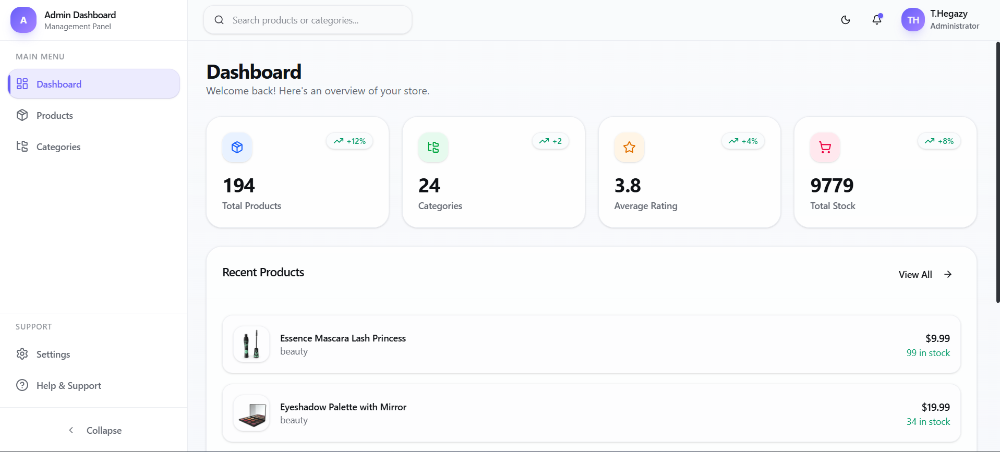
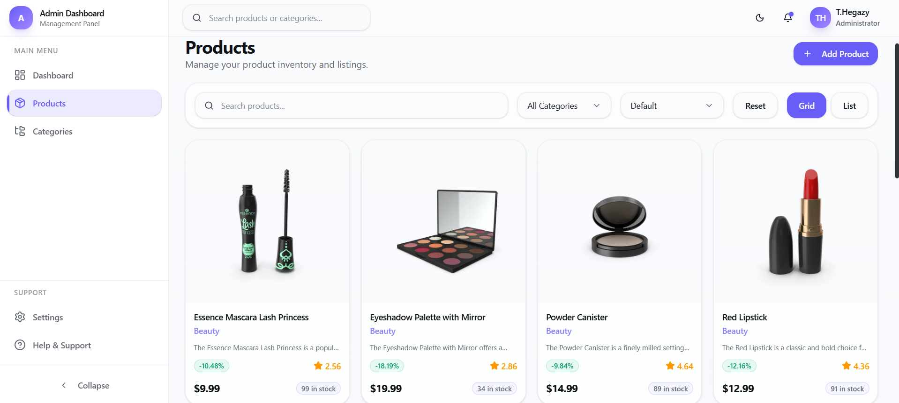
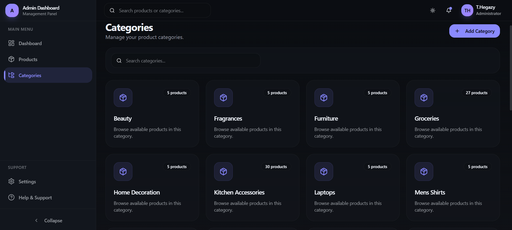
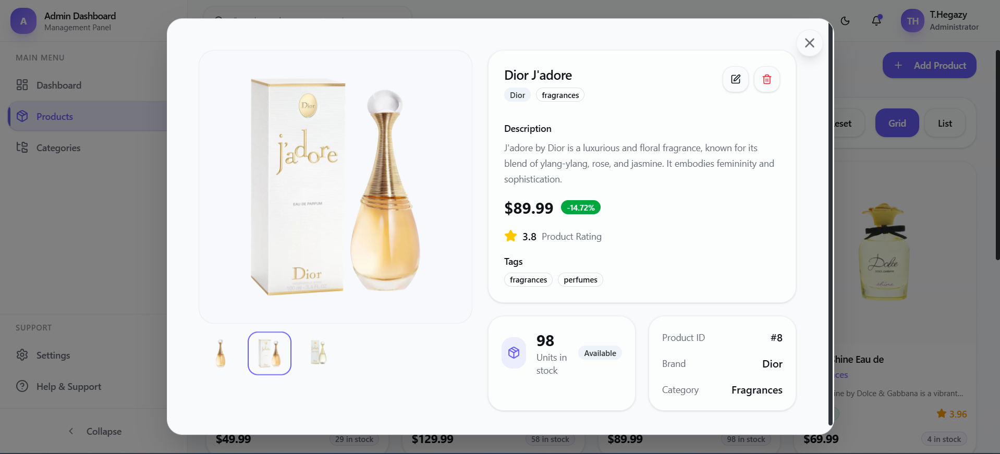
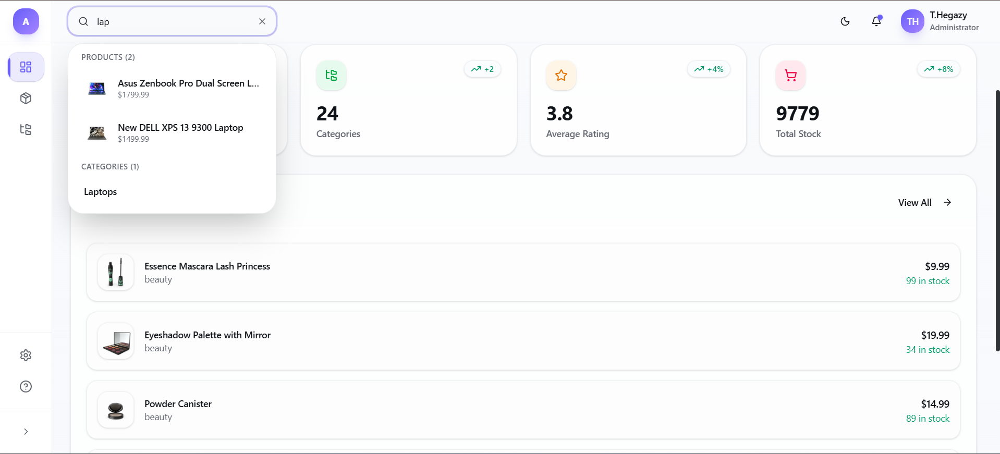
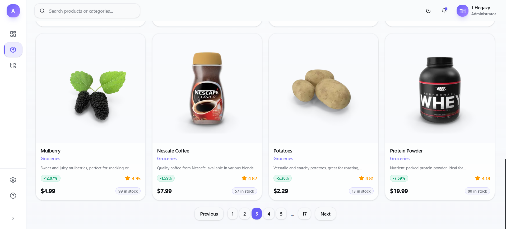
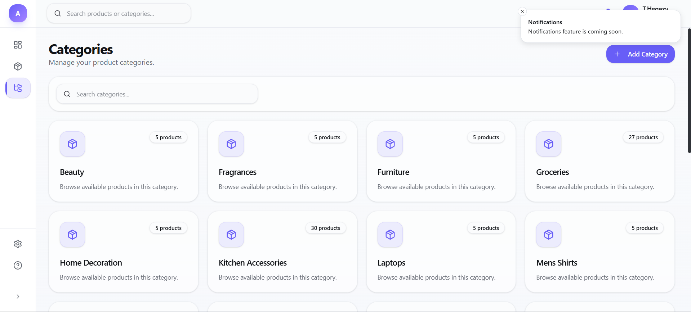
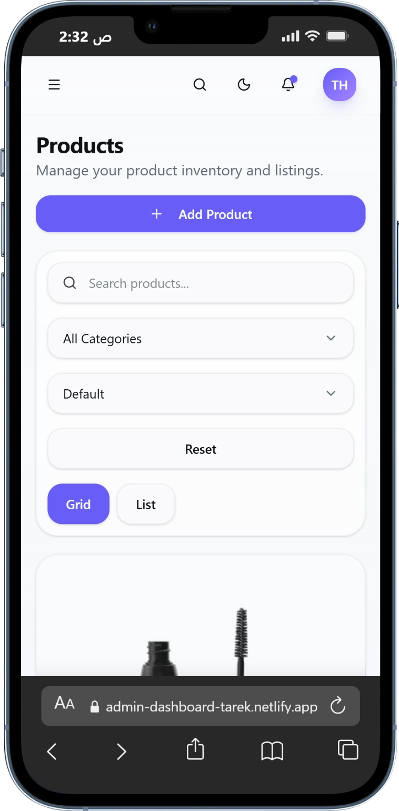
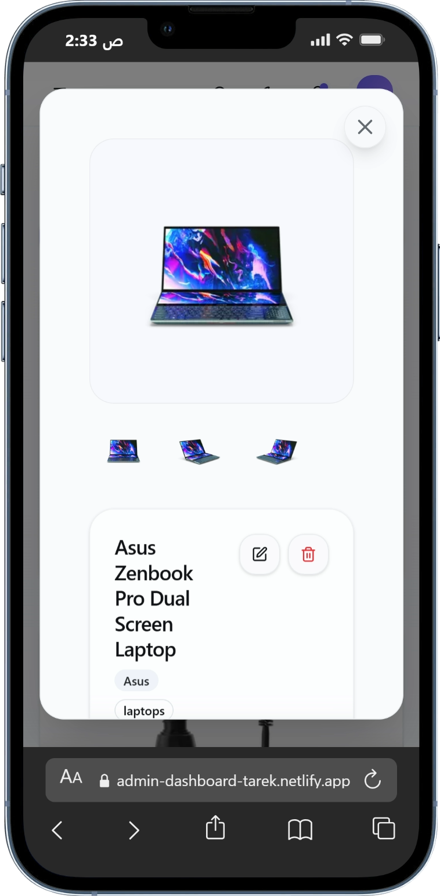
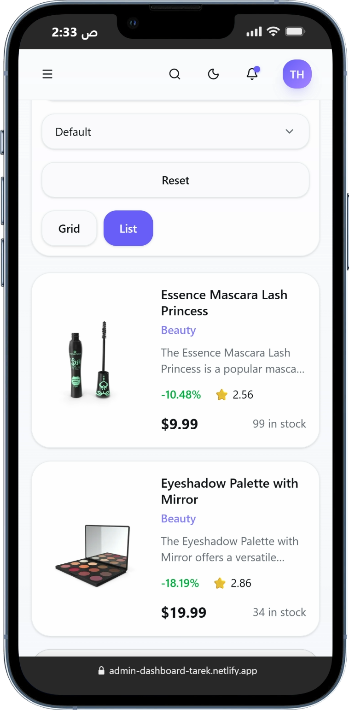

# 🚀 Admin Dashboard — Products & Categories Management

Modern and responsive admin dashboard built with **React**, **TypeScript**, **Vite**, and **Tailwind CSS**.  
The dashboard allows managing products and categories with advanced search, filtering, sorting, pagination, dark mode, and a polished responsive UI.

---

## 🌐 Live Demo

🔗 [Live Demo](https://admin-dashboard-products-categories.vercel.app/)

🔗 [GitHub Repository](https://github.com/Tarek-Hegazy/Admin-Dashboard---Products-Categories)

---

# ✨ Features

- 📊 Responsive Admin Dashboard
- 🛍️ Products Management
- 📂 Categories Management
- 🔎 Global Search
- 🎯 Search + Filters + Sorting
- 📄 Pagination
- 🌙 Dark / Light Mode
- ⚡ Product Details Modal
- 🔔 Toast Notifications
- 🧠 Zustand State Management
- 🔗 URL Query Parameters
- 📱 Fully Responsive Design
- 🎨 Modern UI with Tailwind + shadcn/ui
- 🧱 Reusable Components Architecture
- ⚠️ Error Boundary Handling
- ⌛ Skeleton Loading States
- 🔥 Fully Typed with TypeScript

---

# 🛠️ Tech Stack

## Frontend
- React
- TypeScript
- Vite

## Styling
- Tailwind CSS
- shadcn/ui
- Lucide React

## State Management
- Zustand

## Routing
- React Router DOM

## Notifications
- Sonner

## Utilities
- clsx
- tailwind-merge

---

# 📸 Screenshots

## 🏠 Dashboard



---

## 🛍️ Products Page



---

## 📂 Categories Page (Dark Mode)



---

## 📦 Product Details Modal



---

## 🔎 Global Search



---

## 📄 Pagination



---

## 🔔 Toast Notification



---

## 📱 Mobile Products Page



---

## 📱 Mobile Product Modal



---

## 📱 Mobile List View



---

# 📦 Installation

Clone the project:

```bash
git clone https://github.com/Tarek-Hegazy/Admin-Dashboard---Products-Categories.git
```

Go to project directory:

```bash
cd Admin-Dashboard---Products-Categories
```

Install dependencies:

```bash
npm install
```

Run development server:

```bash
npm run dev
```

---

# 📜 Available Scripts

```bash
npm run dev
```
Runs the app in development mode.

```bash
npm run build
```
Builds the app for production.

```bash
npm run preview
```
Preview production build locally.

```bash
npm run lint
```
Run ESLint.

---

# 🌐 API Reference

This project uses the DummyJSON API.

## Base URL

```txt
https://dummyjson.com
```

## Endpoints Used

### Products
```txt
GET /products
```

### Single Product
```txt
GET /products/:id
```

### Categories
```txt
GET /products/categories
```

---

# 📁 Folder Structure

```txt
src
│
├── components
│   ├── dashboard
│   ├── products
│   ├── categories
│   └── ui
│
├── pages
│
├── stores
│
├── hooks
│
├── layouts
│
├── services
│
├── types
│
├── lib
│
└── routes
```

---

# 🎨 UI Highlights

- Modern clean UI
- Smooth responsive experience
- Consistent design system
- Dark / Light themes
- Mobile-first optimizations
- Reusable UI components

---

# 🚀 Future Improvements

- Authentication System
- Real CRUD Operations
- Charts & Analytics
- Drag & Drop Features
- Advanced Product Tables
- Role-based Access Control
- Unit & Integration Testing
- Backend Integration
- Multi-language Support

---

# 👨‍💻 Author

## Tarek Hegazy

🔗 GitHub:  
[Tarek-Hegazy](https://github.com/Tarek-Hegazy)

---

# ⭐ If you like this project

Give it a star on GitHub ⭐
